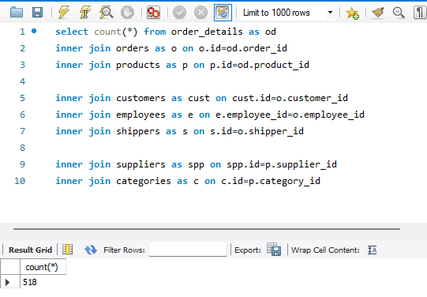
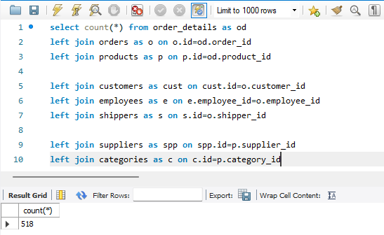
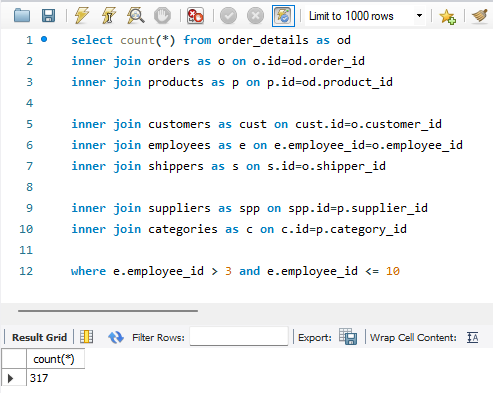
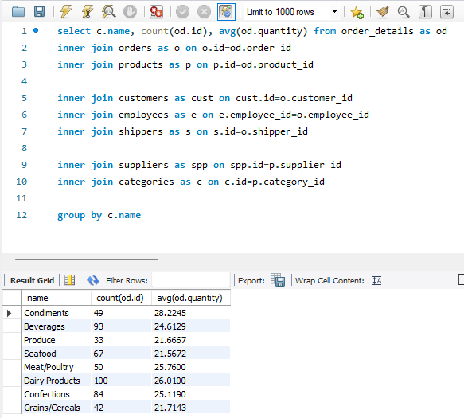
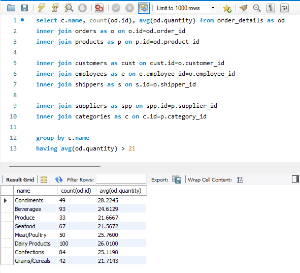
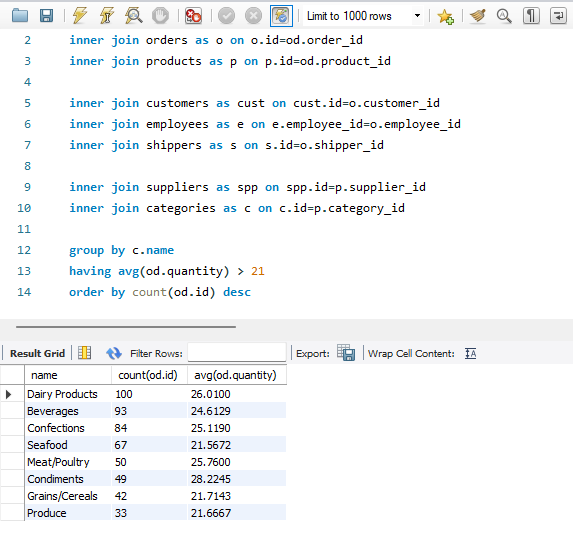
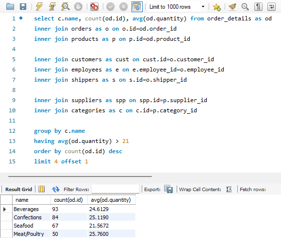

# Домашнє завдання до Теми 4. DML та DDL команди. Складні SQL вирази
https://www.edu.goit.global/learn/18631832/21808779/22222322/homework

## 1. Створити базу даних для керування бібліотекою книг згідно зі структурою, наведеною нижче. Використовуйте DDL-команди для створення необхідних таблиць та їх зв'язків.
[DDL схема](p1_ddl-schema.sql)

## 2. Заповніть таблиці простими видуманими тестовими даними. Достатньо одного-двох рядків у кожну таблицю.
[DML скрипт](p2_dml-script.sql)

## 3. Перейдіть до бази даних, з якою працювали у темі 3. Напишіть запит за допомогою операторів FROM та INNER JOIN, що об’єднує всі таблиці даних, які ми завантажили з файлів: order_details, orders, customers, products, categories, employees, shippers, suppliers. Для цього ви маєте знайти спільні ключі.

Перевірте правильність виконання запиту.
[DDL схема](p3_ddl-schema.sql)

[DQL запит](p3_dql-request.sql)

## 4. Виконайте запити, перелічені нижче.

### Визначте, скільки рядків ви отримали (за допомогою оператора COUNT).
[DQL запит](p4_dql-request-1.sql)

### Змініть декілька операторів INNER на LEFT чи RIGHT. Визначте, що відбувається з кількістю рядків. Чому? Напишіть відповідь у текстовому файлі.
[DQL запит](p4_dql-request-2.sql)

#### Пояснення:
Кількість рядків залежить від запитів. Загальна кількість рядків не змінилась і дорівнює кількості записів в order_details. Те, що кількість не змінилась зі зміною inner join на left join означає, що кожен запис order_details не має foriegn key зі значенням null

### Оберіть тільки ті рядки, де employee_id > 3 та ≤ 10.
[DQL запит](p4_dql-request-3.sql)

### Згрупуйте за іменем категорії, порахуйте кількість рядків у групі, середню кількість товару (кількість товару знаходиться в order_details.quantity)
[DQL запит](p4_dql-request-4.sql)

### Відфільтруйте рядки, де середня кількість товару більша за 21.
[DQL запит](p4_dql-request-5.sql)

### Відсортуйте рядки за спаданням кількості рядків.
[DQL запит](p4_dql-request-6.sql)

### Виведіть на екран (оберіть) чотири рядки з пропущеним першим рядком.
[DQL запит](p4_dql-request-7.sql)

